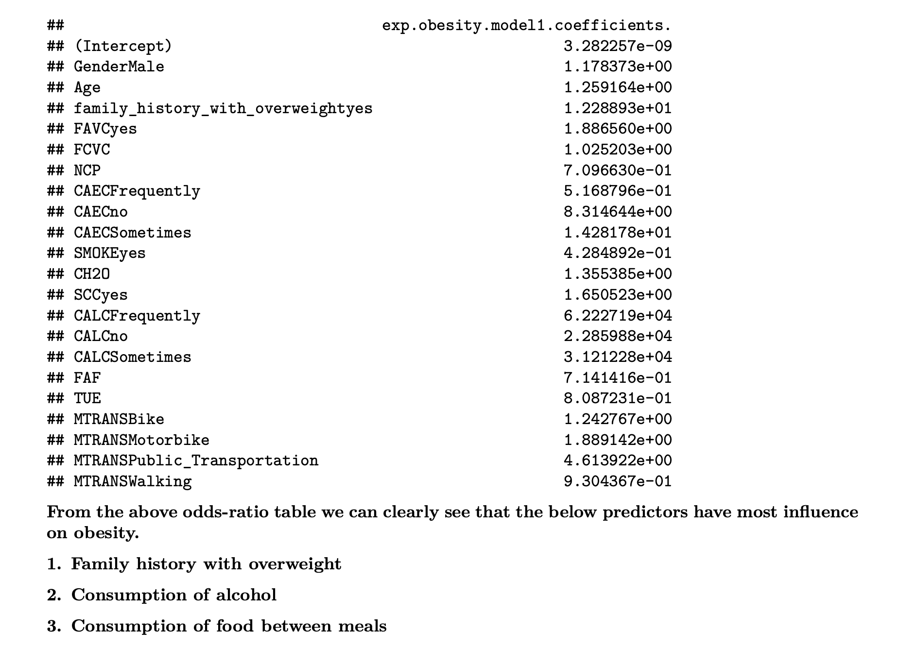

# Statistical Analysis and Regression using R

Obesity levels are measured by BMI (Body Mass Index) which is the ratio between body weight and height, calculated as below equation (Body Mass Index, CDC, n.d.).

  $BMI=\frac{Body Weight}{Height^2}$            (Equation. 1)

BMI greater than `30` is considered _Obesity_ and between `25` to `30` is considered _Overweight_ (Defining Adult Overweight & Obesity, CDC, n.d.).

This analysis will investigate the relationship of Obesity and Body Mass Index (BMI) with eating habits and physical activity. This study can help to identify patterns associated with obesity, such as the quality and quantity of food intake, frequency, duration, and intensity of physical activity. This study can also help to determine the optimal amount and type of physical activity for each obesity level based on the individual’s age and gender. Similarly, this study can help to design a balanced and nutritious diet plan for each obesity level. Furthermore, this study will generate a model to estimate obesity and BMI based on eating habits and physical activity.

### Datasets

1.  _UC Irvine Machine Learning Repository - Obesity levels, Eating Having and Physical activity dataset_.

The dataset identified for this study is taken from UC Irvine Machine Learning Repository (UCI. 2019).  The dataset include data about eating habits, physical activity, weight, height and obesity levels of individuals from the countries of Mexico, Peru and Columbia. The data includes the eating habits and physical activity levels of 498 participants aged between 14 and 61 years.

The originally collected data was preprocessed, such as the removal of missing values, and normalization was performed. It was also balanced to reduce the skewness of the obesity levels. 23% of the source data is actual responses collected over a 30-day survey, while the remaining 77% was synthetically generated using SMOTE (Palechor & de la Hoz Manotas, 2019).

2.  _CDC Nutrition, Physical Activity and Obesity._

This dataset includes data on adults diet, physical activity and weight status from Behavioral Risk Factor
Surveillance System (Nutrition, Physical Activity, and Obesity, CDC, 2023). 
        
This dataset has 33 columns, however the main columns which will be used in this study are given below.
  
          - LocationAbbr (Location of the datasoure like particular US State or territories)
          - Topic (Obesity or Physical Activity)
          - Question (Question regarding obesity, overweight and physical activity)
          - Data Value (in percentage of population)
          - Race/Ethnicity
 
This dataset will be used to analyze the distribution and variation in the percentage of obesity in adults based on geography and ethnicity. Analysis of the dataset will help identify whether obesity varies with race/ethnicity and geography.

**Note: The datasets can be downloaded from mentiond data sources and not all daatasets available in `datasets` directory due to size limitations.**

### Approach
As mentioned above (Equation. 1), BMI is calculated from weight and height. Therefore, in order to determine the relationship between obesity and eating habits, and physical activity, we need to identify that there is a relationship between weight, height, eating habits, and physical activity. If we find a relationship between eating habits and physical activity with weight and height. In that case, we can estimate the influence (negative or positive) of these factors on BMI and obesity.

Exploratory data analysis will help to identify relationships, patterns, and gather insights from the dataset. The correlation matrix will help to identify the correlation between the numerical variables and BMI. T-tests will confirm if there is evidence of a relationship between eating habits, physical activity, and BMI. ANOVA will help to analyze the variance and how much variation in the BMI is accounted for by eating habits and physical activity.

Various plots like histograms and QQ plots will identify the distribution of the variables regarding various obesity levels. Box plots will aid in determining five-point summary statistics and locating outliers. Scatter plots will help to identify any linear relationship between BMI, weight, height, eating habits, and physical activity.

Furthermore, we model the data to predict BMI and obesity based on eating habits and physical activity using **Linear Regression** and **Logistic Regression**. These models were analyzed for better fit using **AIC and BIC**. Impact of Bias and Outliers are investigated with **Standardized Residuals** and **Cook's distance** metrics. Models are also investigated for *multicollinearity* issues using **VIF** **Residual plot** and **QQ plot of residuals**. 

### Results

Based on the exploratory data analysis of the obesity dataset, we have observed that there is relationship of physical activity and eating habits with BMI and obesity. Therefore we can fit a model to _predict BMI and Obesity using physical activity and eating habits.

The correlation heatmap, correlation coefficients, and correlation t-tests show evidence of the relationship between BMI and eating habits like number of meals, consumption of vegetables, consumption of water, and frequency of physical activity. Similarly, boxplots, cross tables, and chi-squared tests show that there is evidence of the relationship between obesity and eating habits like high calorific food consumption, taking food between meals, alcohol consumption, and a family history of being overweight.

We also investigated that data model can be fitted to predict BMI and Obesity based on eating habits and physical activity. The  model analysis for bias, outliers, and linearity assumptions shows that the linear regression model to predict BMI and logistic regression to predict Obesity risk are feasible. Therefore, BMI and Obesity can be predicted based on eating habits and physical activity. 

From the logistics regression model analysis, we see that a family history of being overweight, consumption of alcohol, and consumption of food between meals are the essential factors in predicting obesity risk, which do line up with general understanding. Hence, we can educate people about these leading factors, which can help to reduce the risk of obesity.

 Linear Regression Model Summary

 Logistic Regression Model Coefficients showing most influential variables in predicting Obesity

Residual Plot of Linear Regression Model 

### References

  Body Mass Index. (n.d.). _Centers for Disease Control and Prevention._             
   **https://www.cdc.gov/healthyweight/assessing/bmi/index.html#:~:text=Body%20Mass%20Index%20(BMI),**    
   **%20is,or%20health%20of%20an%20individual.**
  
  Defining Adult Overweight & Obesity. (n.d.). _Centers for Disease Control and Prevention._             
   **https://www.cdc.gov/obesity/basics/adult-defining.html**     
  
  Estimation of obesity levels based on eating habits and physical condition. (2019). _UCI Machine 
   Learning Repository._ **https://doi.org/10.24432/C5H31Z.**
  
  Gozukara Bag, H.G., Yagin, F.H., Gormez, Y., González, P.P., Colak, C., Gülü, M., Badicu, G., Ardigò,      L.P. 2023. Estimation of Obesity Levels through the Proposed Predictive Approach Based on Physical 
   Activity and Nutritional Habits. _Diagnostics_. 13(18), 2949. 
   **https://doi.org/10.3390/diagnostics13182949**
  
  Nutrition, Physical Activity, and Obesity - Behavioral Risk Factor Surveillance System. (2023). 
   _Centers for Disease Control and Prevention._             
   **https://data.cdc.gov/Nutrition-Physical-Activity-and-Obesity/**
   **Nutrition-Physical-Activity-and-Obesity-Behavioral/hn4x-zwk7**
      
  Palechor, F.M., de la Hoz Manotas, A. (2019). Dataset for estimation of obesity levels based on eating 
   habits and physical condition in individuals from Colombia, Peru and Mexico. _Data Brief_. 25, 104344. 
   **https://doi.org/10.1016/j.dib.2019.104344**
                  